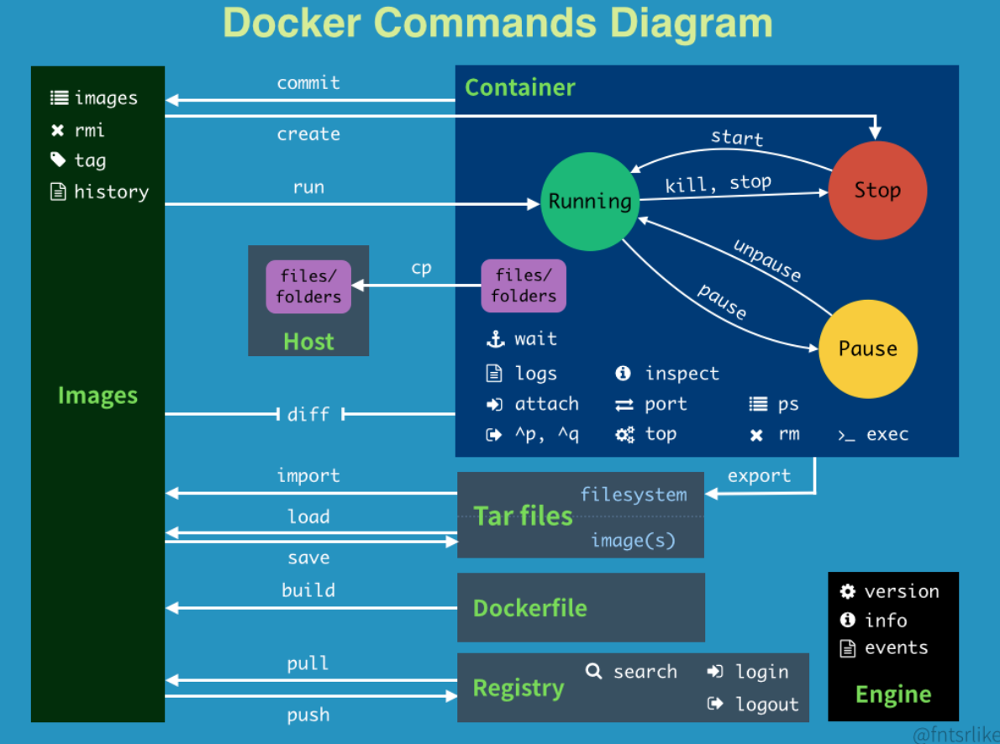

# Commands

</img>

01. `docker xxx --help` - show help information
02. `docker image ls` - show all the docker images
3. `docker ps -all (docker container ls)` - show all the docker containers
4. `docker build -t image_name:version .` - build an image from a Dockerfile with name and version(you should have Dockerfile in your work directory)
5. `docker run --publish 8000:8080 --detach --name container_name image_name` - run a image with a container in the background(detach) forward local machine port 8000 to docker private port 8080
06.  `docker run -it image_id /bin/sh` - run a container and get interactive shell
07.  `docker exec -it container_name /bin/bash` - run a bash shell with iteracitve mode with your running container
08. `docker run --runtime=nvidia --shm-size 1g image_id` - run the container (using nvidia driver), with shared memory 1G
09.    `docker stop container_name` - stop the running container

10.  `docker rm --force container_name` - stop the container and delete the container
11.  `docker cp your_local_file container_id:/home/`
12.  `docker volume ls` - list docker volume on your local file system.
13.  `docker volume create --name volume_name` - create a volume so that you can get the data from the container.

14. **management - `docker images | grep "<none>" | awk '{print $3}' | xargs docker rmi` - 找出 tags 為 none， print出前3個，把他砍了**，用這個比較好，不會錯殺無辜
15. management - `docker ps -a | grep 'weeks ago' | awk '{print $1}' | xargs --no-run-if-empty docker rm` - 跳出幾週前的，把他砍了，要注意不要砍到要用的
16. `docker rmi $(docker images -q -f "dangling=true")` - 刪除虛懸的 images - 沒有 repo，沒有 tag，存粹是 build 的產物
17. `docker image prune -a` - prune all images (danguous)
18. `docker image prune` - prune only dangling

[some commands](https://hackmd.io/@titangene/rk3zjKVIz?fbclid=IwY2xjawEWgMdleHRuA2FlbQIxMAABHQwImw5me90_UmMGdGqVtC-SFfF_ejva3UXvgxoWyq2BQRSz75axBJPBVw_aem_0wPOYivMK-2hDDywuG2cWA)

# Development

1. Dokcer building images 時，每一個 command 會產生一個 intermidate layer，並且用 Container 執行指令，所以 building images 時，會產生多個 container，而 build failed 的時候，會產生 cache images (記憶體殺手)

2. Docker `FROM` 是 inmutable, RUN, COPY, ... 是 writable 

3. 流程 -- 撰寫 Dockerfile --> docker build (image) --> docker run (image as a container)

4. Dockerfile 如果作為開發環境，每次 ssh 會建立一個 fingerprint，如果 container 砍掉重啟，host/port 都相同，會發生 fingerprint 不一致，進而導致登入不進去
   1. 砍 know_host 相同 host/port，在重新登入 (TODO: 自動化?)

5. 事實上， `docker exec container_name command` - 會把 stdout 吐回 vm 上